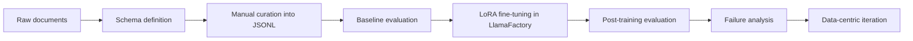
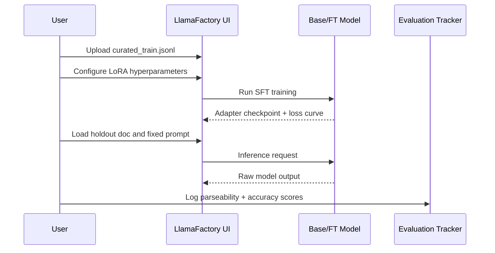
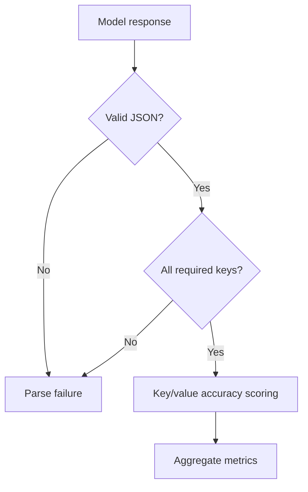

# Structured Output Fine-Tuning for JSON Extraction (Llama 3.2 + LlamaFactory)

   

## Objective

Fine-tune `Llama-3.2-3B-Instruct` to reliably extract machine-parseable JSON from unstructured invoices and purchase orders, prioritizing parse success rate for production automation.

## Tech Stack

| Layer | Tools |
|---|---|
| Data curation | Hugging Face datasets (CORD, SROIE, DocVQA, synthetic PO source) |
| Fine-tuning | LlamaFactory Web UI (SFT + LoRA) |
| Model | Llama 3.2 3B Instruct |
| Evaluation | LlamaFactory inference tab, CSV/manual scoring |
| Documentation | Markdown + Mermaid |

## Repository Structure

```text
.
├── schema/
│   ├── invoice_schema.md
│   └── po_schema.md
├── data/
│   ├── curated_train.jsonl
│   └── curation_log.md
├── screenshots/
│   ├── training_config.png
│   └── loss_curve.png
├── eval/
│   ├── baseline_responses.md
│   ├── baseline_scores.csv
│   ├── finetuned_responses.md
│   ├── finetuned_scores.csv
│   ├── before_vs_after.md
│   ├── summary.md
│   └── failures/
│       ├── failure_01.md
│       ├── failure_02.md
│       ├── failure_03.md
│       ├── failure_04.md
│       └── failure_05.md
├── prompts/
│   ├── prompt_iterations.md
│   └── prompt_eval.md
├── training_config.md
├── architecture.md
├── projectdocumentation.md
├── report.md
└── README.md
```

## End-to-End Flow



## Training and Evaluation Pipeline



## Key Results

- Baseline parse success rate: **45.0%**.
- Post fine-tuning parse success rate: **95.0%**.
- Absolute gain: **+50.0 percentage points**.
- Major failure reduction: markdown/prose formatting drift substantially reduced.

## Setup and Reproduction

1. Install LlamaFactory and launch `llamafactory-cli webui`.
2. Load `Llama-3.2-3B-Instruct`.
3. Use dataset `data/curated_train.jsonl`.
4. Apply hyperparameters documented in `training_config.md`.
5. Capture configuration and loss screenshots under `screenshots/`.
6. Evaluate on the same 20 held-out docs and update eval artifacts if rerunning.

## Usage Prompt

```text
Extract fields and return ONLY valid JSON with the correct schema for invoice or purchase order. No markdown or explanation.
```

## Execution Logic



## Notes

- Adapter/model binaries are intentionally excluded from this repo.
- This repository focuses on data quality, reproducible config, and structured evaluation artifacts.
