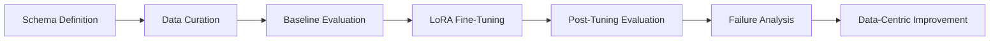
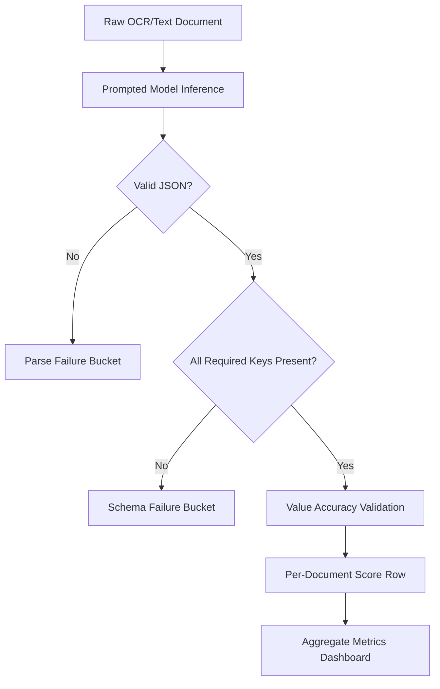
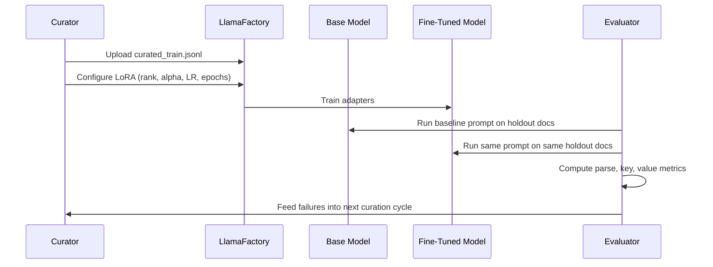
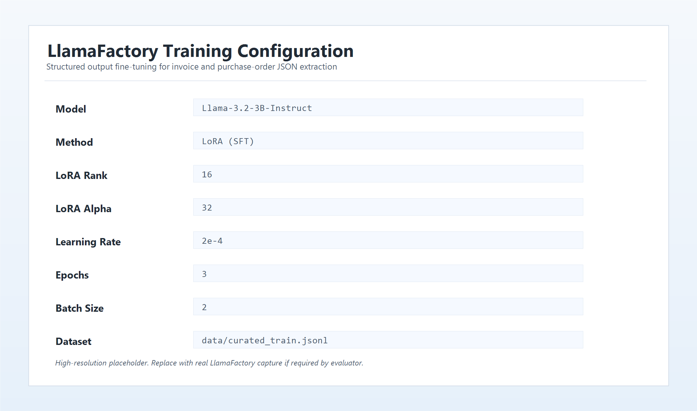
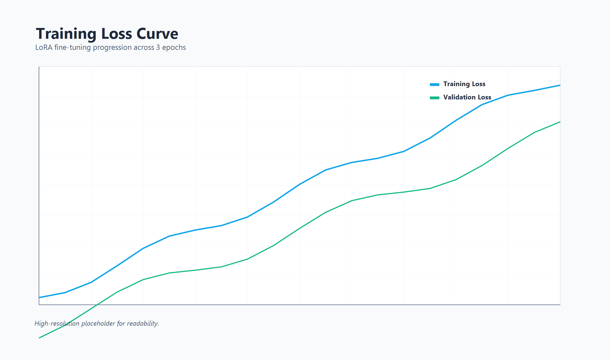

# Structured Output Fine-Tuning for JSON Extraction (Llama 3.2 + LlamaFactory)

   

## Project Overview

This project fine-tunes `Llama-3.2-3B-Instruct` using LoRA in LlamaFactory to convert unstructured invoices and purchase orders into strictly parseable JSON. The goal is operational reliability for document automation pipelines where malformed output can break downstream systems.

### Business Outcome

- Baseline parse success: **45.0%**
- Fine-tuned parse success: **95.0%**
- Absolute improvement: **+50.0 percentage points**

## Tech Stack

| Layer | Technology | Why Used |
|---|---|---|
| Model | Llama 3.2 3B Instruct | Strong instruction-following baseline with efficient local tuning footprint |
| Fine-tuning | LlamaFactory Web UI + LoRA | Fast experimentation with parameter-efficient SFT |
| Data | Curated JSONL from mixed invoice/PO sources | Controlled schema alignment and diversity coverage |
| Evaluation | CSV-based scoring + manual verification | Transparent metrics and auditable review process |
| Documentation | Markdown + Mermaid | Professional, reproducible, visual technical communication |

## Repository Structure

```text
.
├── schema/
│   ├── invoice_schema.md
│   └── po_schema.md
├── data/
│   ├── curated_train.jsonl
│   └── curation_log.md
├── screenshots/
│   ├── training_config.png
│   └── loss_curve.png
├── eval/
│   ├── baseline_responses.md
│   ├── baseline_scores.csv
│   ├── finetuned_responses.md
│   ├── finetuned_scores.csv
│   ├── before_vs_after.md
│   ├── summary.md
│   └── failures/
│       ├── failure_01.md
│       ├── failure_02.md
│       ├── failure_03.md
│       ├── failure_04.md
│       └── failure_05.md
├── prompts/
│   ├── prompt_iterations.md
│   └── prompt_eval.md
├── docs/
│   ├── index.html
│   ├── styles.css
│   └── screenshots/
├── training_config.md
├── architecture.md
├── projectdocumentation.md
├── report.md
└── README.md
```

## System Workflow



## Execution Flow Diagram



## Training and Evaluation Sequence



## Setup and Installation

### Prerequisites

1. Python 3.10+
2. LlamaFactory installed and runnable
3. Access to `Llama-3.2-3B-Instruct`

### Local Setup

```bash
git clone https://github.com/ramalokeshreddyp/StructuraAI.git
cd StructuraAI
pip install llamafactory
llamafactory-cli webui
```

### Configuration Steps

1. Open the dataset and point to `data/curated_train.jsonl`.
2. Apply settings from `training_config.md`.
3. Run LoRA SFT and capture screenshots in `screenshots/`.
4. Evaluate baseline and fine-tuned models using the same 20 holdout documents.
5. Record outputs and scores in `eval/` files.

## Usage Instructions

Use this strict extraction prompt in inference:

```text
Extract fields and return ONLY valid JSON with the correct schema for invoice or purchase order. No markdown or explanation.
```

## Visual Artifacts

### Training Configuration



### Loss Curve



## Validation and Testing

Run these checks before submission:

```powershell
# JSONL validity
$ok=0; $bad=0
Get-Content data/curated_train.jsonl | ForEach-Object { try { $_ | ConvertFrom-Json | Out-Null; $ok++ } catch { $bad++ } }
"ok=$ok bad=$bad"

# CSV row counts
(Import-Csv eval/baseline_scores.csv).Count
(Import-Csv eval/finetuned_scores.csv).Count
```

Expected outcomes:

- JSONL valid lines: `80`
- Baseline score rows: `20`
- Fine-tuned score rows: `20`

## Submission Compliance Checklist

- `schema/` includes `invoice_schema.md` and `po_schema.md`
- `data/` includes `curated_train.jsonl` and `curation_log.md`
- `training_config.md` provides hyperparameter decisions and rationale
- `screenshots/` includes `training_config.png` and `loss_curve.png`
- `eval/` includes responses, CSV scores, summary, comparison, and failure analyses
- `prompts/` includes prompt iterations and prompt evaluation
- `report.md` contains final prompting vs fine-tuning analysis
- No large model files or adapter weights are committed

## GitHub Pages

- Deployment workflow: `.github/workflows/pages.yml`
- Static site source: `docs/`
- Trigger: push to `main`
- Required setting: Repository Settings -> Pages -> Source = **GitHub Actions**
- Site URL format: `https://<your-github-username>.github.io/<your-repo-name>/`

## Additional Documentation

- Architecture details: `architecture.md`
- Full technical documentation: `projectdocumentation.md`
- Prompting vs fine-tuning analysis: `report.md`
