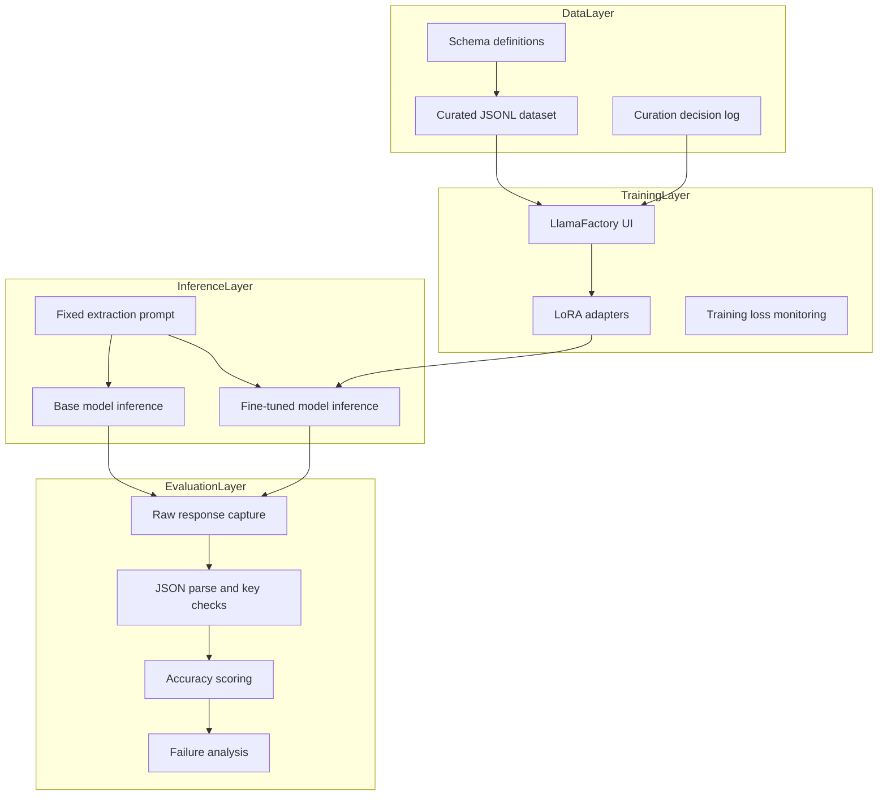

# System Architecture

## Architectural Goal

Deliver reliable machine-parseable JSON extraction from noisy business documents using data-centric fine-tuning.

## Component View

## Data Flow

1. Define strict invoice and PO schemas with explicit missing-field policy.
2. Curate 80 schema-compliant examples into JSONL format.
3. Evaluate base model on held-out set and score parseability + accuracy.
4. Fine-tune with LoRA in LlamaFactory web UI.
5. Re-evaluate with same documents and prompt for ablation-style comparison.
6. Analyze residual failures and feed changes back into curation.

## Design Rationale

- LoRA chosen for parameter efficiency and practical local training.
- Schema-first curation enforces deterministic downstream contract.
- Same prompt and same holdout set isolate the contribution of fine-tuning.
- Parse success rate prioritized because it directly maps to automation reliability.

## Integration Details

- Input contracts: unstructured OCR text snippets from invoice/PO documents.
- Output contracts: strict JSON object with fixed keys and numeric types.
- Evaluation contracts: CSV scoring with parseability and accuracy dimensions.

## Pros and Cons

Pros:
- Strong gain in parse reliability with relatively small training set.
- Practical workflow through no-code UI.
- Clear audit trail through curation and failure logs.

Cons:
- Performance sensitive to curation quality and layout coverage.
- Residual edge failures require iterative data augmentation.
- Manual scoring introduces reviewer overhead.

## Scalability Considerations

- Increase schema coverage by adding document subtypes and edge layouts.
- Introduce deterministic post-validators for numeric/type enforcement.
- Move from manual to semi-automated evaluation for larger test suites.
- Maintain periodic retraining with drift-aware dataset refresh.
