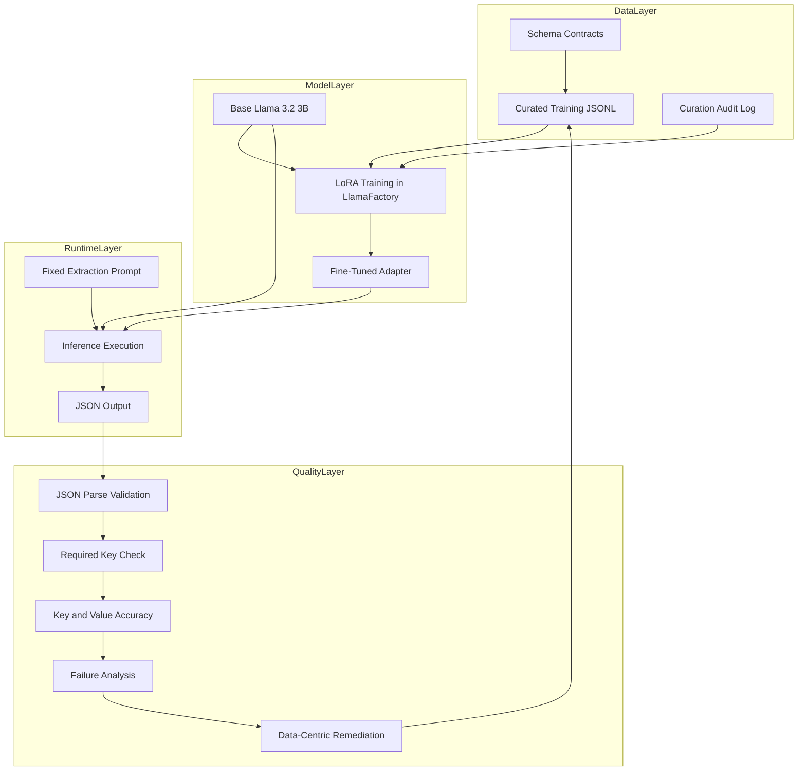
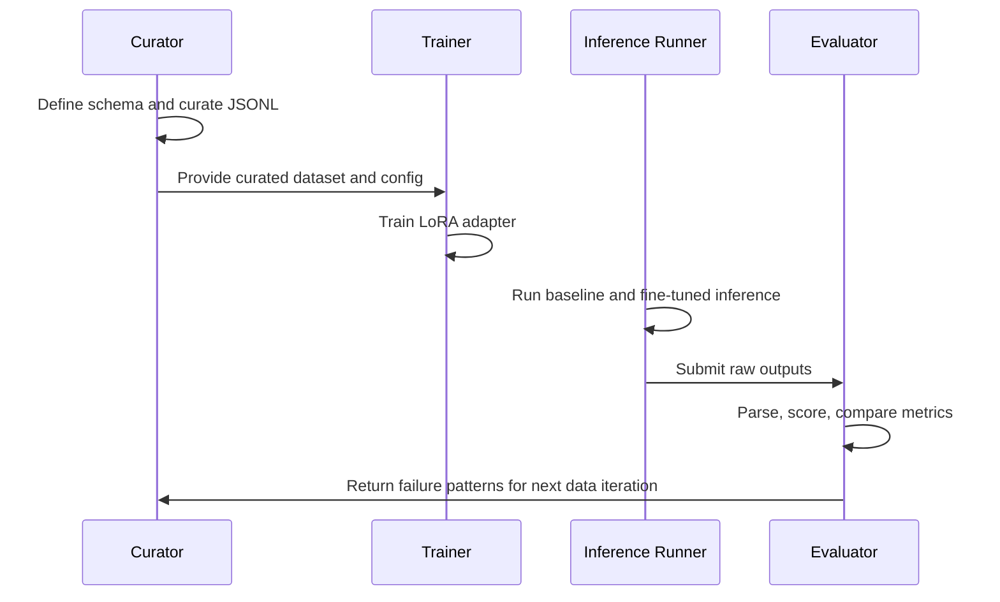

# System Architecture

## Main Objective

Design and validate a robust extraction system that consistently returns schema-compliant JSON from unstructured invoice and purchase-order text, with predictable behavior under document layout variability.

## High-Level Architecture

## Layer Responsibilities

| Layer | Responsibility | Core Artifacts |
|---|---|---|
| Data Layer | Define schema contracts and curate representative training examples | `schema/`, `data/curated_train.jsonl`, `data/curation_log.md` |
| Model Layer | Execute LoRA fine-tuning with stable hyperparameters | `training_config.md`, `screenshots/` |
| Runtime Layer | Run deterministic prompt-based extraction | `prompts/`, inference outputs |
| Quality Layer | Evaluate, score, compare, and diagnose failures | `eval/` and `eval/failures/` |

## Module Architecture

### Module Details

1. Schema Module
- Defines mandatory keys, optional key policy, and type expectations.

2. Curation Module
- Produces JSONL training examples with diversity across layouts, currencies, and missing fields.

3. Training Module
- Applies LoRA settings tuned for small-to-medium dataset adaptation efficiency.

4. Inference Module
- Uses one fixed prompt for both baseline and fine-tuned runs to isolate tuning impact.

5. Evaluation Module
- Scores parseability, key coverage, and value fidelity in CSV format for reproducibility.

6. Failure Analysis Module
- Provides root-cause analysis and explicit data-level remediation recommendations.

## Data and Execution Flow

## Integration Contracts

### Input Contract
- Unstructured text representing invoice or PO content.

### Output Contract
- Strict JSON object following schema key set and value typing rules.

### Evaluation Contract
- One score row per document with fields for parse validity, required-key completeness, key accuracy, value accuracy, and notes.

## Design Decisions and Rationale

1. LoRA over full fine-tuning
- Reduces memory/computation cost while retaining strong task adaptation.

2. Schema-first pipeline
- Forces deterministic output shape and minimizes post-processing ambiguity.

3. Fixed holdout and prompt for A/B evaluation
- Ensures improvement attribution remains tied to fine-tuning, not prompt drift.

4. Data-centric remediation loop
- Directly targets observed model failures for compounding quality gains.

## Performance and Scalability Strategy

1. Add schema variants for additional document classes.
2. Expand training with edge-case clusters discovered in failure reports.
3. Introduce automated validators and retry logic for production-grade robustness.
4. Maintain periodic re-training with drift monitoring and versioned evaluation baselines.

## Pros and Cons

### Advantages

- Significant parse reliability gain with manageable training cost.
- Transparent, auditable process with complete evidence trail.
- Clear separation of concerns across curation, training, evaluation, and analysis.

### Limitations

- Strongly dependent on diversity quality of curated samples.
- Residual edge-layout errors remain without targeted augmentation.
- Manual scoring effort grows with larger evaluation suites.
