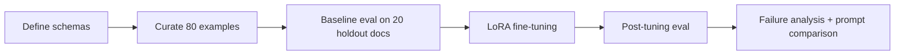
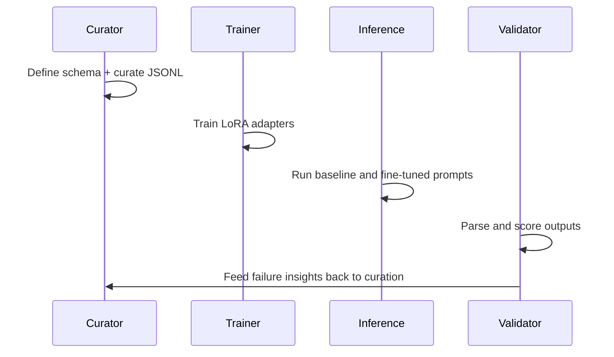

# Project Documentation

## Problem Statement

Enterprise document automation fails when LLM outputs are not consistently parseable. This project targets that operational bottleneck by fine-tuning Llama 3.2 to output strict schema-conformant JSON for invoices and purchase orders.

## Project Objective

- Build robust extraction behavior where the model returns valid JSON with required keys and correct value types.
- Quantify pre/post fine-tuning improvements on held-out documents.
- Identify residual failure modes and prescribe data-centric remediations.

## Workflow

## Key Components

- `schema/`: binding schema contracts for invoice and PO outputs.
- `data/`: curated JSONL training dataset and curation evidence log.
- `eval/`: raw outputs, per-sample scoring, metric comparison, and failures.
- `prompts/`: prompt-only experiment for control comparison.
- `training_config.md`: reproducible hyperparameter rationale.

## Data Curation Strategy

- Enforced fixed key set and value typing across all examples.
- Added layout diversity to prevent overfitting to one document pattern.
- Explicitly included missing optional fields (`null`) to prevent hallucinations.
- Included non-USD currencies and multi-item tables for generalization.

## Evaluation Method

- Same 20 held-out documents and same prompt before and after fine-tuning.
- Scored each response on parseability and schema completeness.
- Computed key and value accuracy against manually verified ground truth.

## Observed Outcomes

- Parse success improved from 45.0% to 95.0%.
- Markdown/prose formatting failures sharply reduced.
- Remaining failures concentrated in edge layouts and nested typing errors.

## Testing and QA Strategy

- Manual ground-truth verification for training and holdout samples.
- Per-document scoring with explicit notes on failure class.
- Failure documents include concrete, data-level remediation actions.

## Production Readiness Notes

- Current setup is suitable for pilot deployment with human-in-the-loop exceptions.
- Recommended hardening: output JSON schema validator and retry policy.
- Recommended next iteration: augment data for fence-like artifacts, swapped-role PO headers, and wrapped line-item tables.

## Execution Sequence

