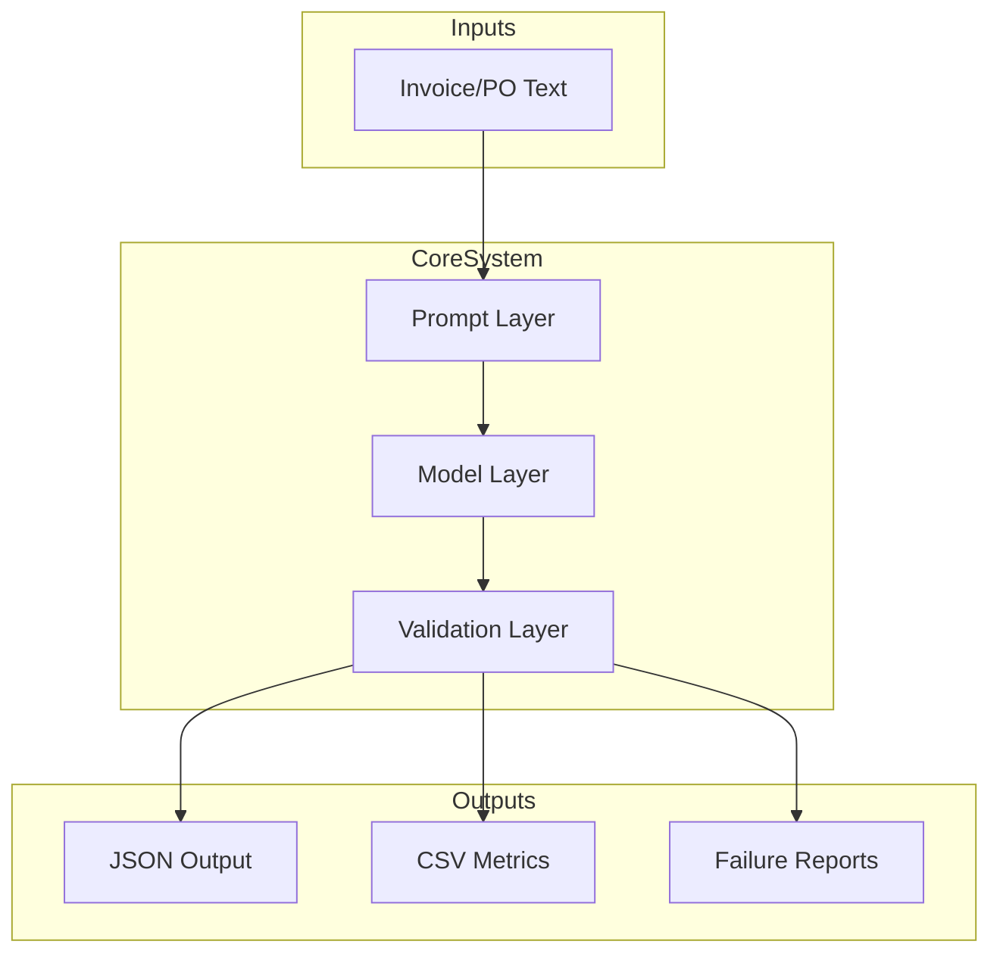
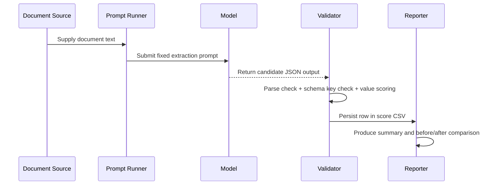

# Project Documentation

## 1. Project Idea and Objective

This project delivers a structured-output extraction system for business documents, focused on invoices and purchase orders. The central objective is to improve output reliability from free-form model responses to strictly parseable JSON, enabling robust downstream automation.

Primary goals:

1. Enforce schema-consistent JSON output for invoice and PO tasks.
2. Improve parse success and extraction accuracy using LoRA fine-tuning.
3. Provide complete process traceability across data curation, training, evaluation, and failure analysis.

## 2. End-to-End Workflow

## 3. System Architecture Summary

Detailed architecture is captured in `architecture.md`.

## 4. Core Components and Responsibilities

| Component | Responsibility | Key Files |
|---|---|---|
| Schema contracts | Define mandatory fields, optional policy, value constraints | `schema/invoice_schema.md`, `schema/po_schema.md` |
| Curation pipeline | Build diverse, schema-aligned training examples | `data/curated_train.jsonl`, `data/curation_log.md` |
| Training configuration | Set LoRA hyperparameters with rationale | `training_config.md` |
| Evaluation pipeline | Measure baseline vs fine-tuned quality | `eval/*.md`, `eval/*.csv` |
| Failure diagnostics | Analyze residual errors and remediation strategy | `eval/failures/failure_*.md` |
| Prompt experiments | Compare prompting-only improvements | `prompts/prompt_iterations.md`, `prompts/prompt_eval.md` |

## 5. Tech Stack and Justification

1. Llama 3.2 3B Instruct
- Strong general instruction model that adapts well to structured extraction tasks.

2. LoRA (via LlamaFactory)
- Parameter-efficient adaptation suitable for limited compute and moderate dataset size.

3. JSONL data format
- Standard, line-oriented training format with easy validation and reproducibility.

4. CSV score sheets
- Enables transparent metrics and deterministic re-checking.

5. Mermaid-based visual documentation
- Improves technical readability for reviewers and collaborators.

## 6. Problem-Solving Approach

### Step 1: Define deterministic schemas
- Enforced key contracts and null-handling to prevent output ambiguity.

### Step 2: Data-centric curation
- Introduced layout, field-presence, currency, and line-item diversity to improve generalization.

### Step 3: Controlled A/B evaluation
- Used same holdout set and same prompt before and after fine-tuning.

### Step 4: Failure-driven iteration
- Residual errors mapped to explicit data augmentation strategies.

## 7. Data Flow and Execution Flow

## 8. Testing Strategy and Validation Checks

Testing focuses on both artifact integrity and model output quality.

### Artifact Integrity Validation

1. JSONL syntax check for all lines.
2. Required artifact presence check for submission directories/files.
3. CSV structure verification (row count and required columns).
4. Screenshot presence and readability checks.
5. Scan for forbidden large model/adaptor files.

### Quality Validation

1. Parse success ratio.
2. Required-key completeness.
3. Key accuracy and value accuracy.
4. Error taxonomy consistency in failure reports.

## 9. Advantages and Benefits

1. Reliable machine-consumable output for automation pipelines.
2. Cost-efficient tuning strategy with measurable quality gains.
3. Reproducible and auditable process documentation.
4. Structured failure analysis enabling targeted improvement.

## 10. Tradeoffs and Limitations

1. Small holdout size may under-represent rare edge cases.
2. Manual verification can become costly at larger scales.
3. Remaining failures require iterative data expansion for complete robustness.

## 11. Integration Details

### Upstream Integration
- Accepts OCR or extracted raw text from document ingestion systems.

### Core Integration
- Prompt layer, model layer, and validation layer operate as composable stages.

### Downstream Integration
- JSON can be consumed by ERP/accounting pipelines after schema validation.

## 12. Production Readiness Guidance

Current state is submission-ready and suitable for pilot deployment. For production hardening:

1. Add strict runtime JSON schema validator and retry logic.
2. Add confidence thresholds with human-review fallback.
3. Expand continuous evaluation set for drift detection.
4. Version model/prompt/data together for release traceability.

## 13. Verification Checklist

- Required artifacts exist and match task specification.
- JSONL and CSV files are structurally valid.
- Baseline and fine-tuned evaluations are aligned and reproducible.
- Failure analysis files include root cause and remediation plan.
- Documentation is complete, consistent, and professionally structured.
